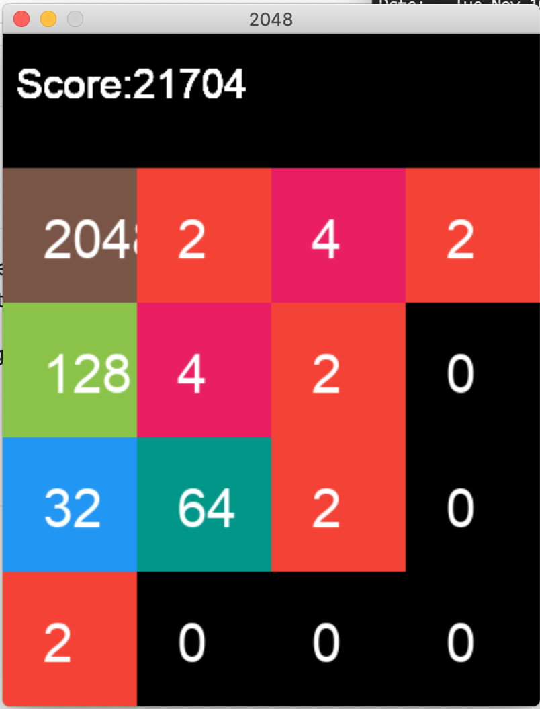
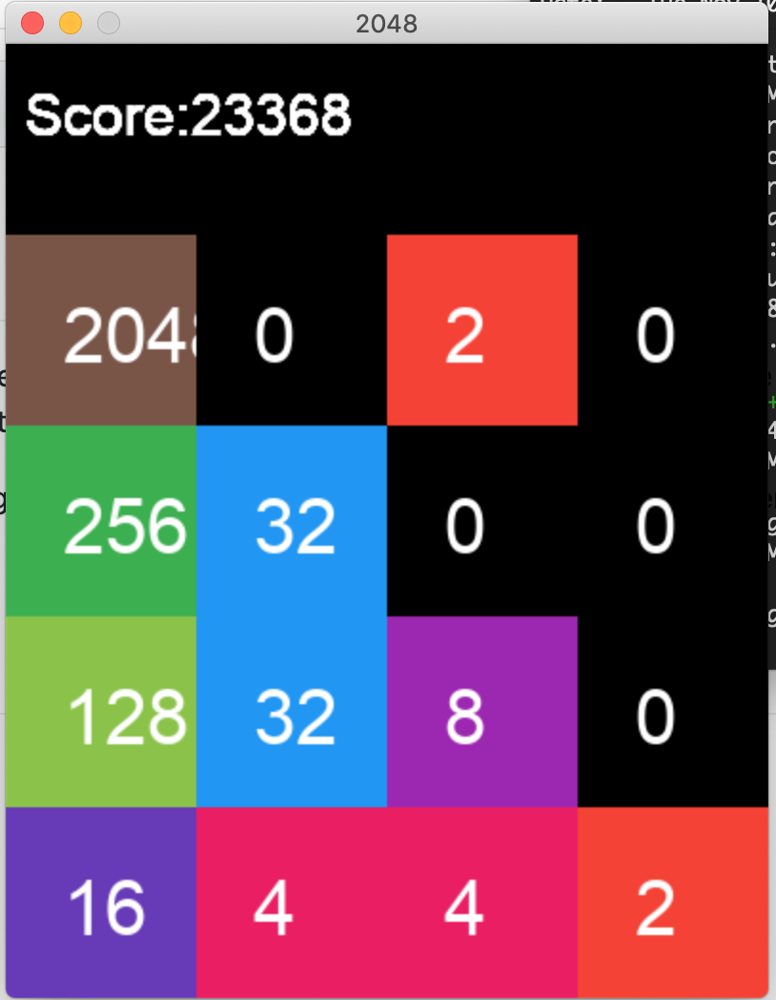

# AI play Game 2048 
Use AI to play the game 2048 by itself and reach high score tile consistently. We use dfs to grow the
simulation tree to desire height, then AI apply the algorithm and picks the best action estimated
from the current board.

The game could be played normally pressing up, down, left, right keys to play.
Or you can press enter to let computer play instead.

Base game engine is from [here](https://gist.github.com/lewisjdeane/752eeba4635b479f8bb2).

## Algorithm
### GrowGameTree(height)
while depth is not height:
- If it's players turn:
  - For each possible move by players:
    - Move in one of the directions
    - Increment depth by 1 and switch game state to "computer/chance"
    
- If it's the computer's turn:
  - For each empty spaces on the board:
    - randomly place a tile 2 or 4
    - Increment depth by 1 and switch game state to "player" 

### Minimax2048(node)
- If node is terminal state, meaning leaf node of the current gametree,
we simply add all the tile's value with the weighted matrix and return the result.

- If node is computer state, we compute the all current node's children's score
and then average it by number of empty spaces, and then return the result.
To compute the children's score, recursively call minimax2048 on each children.

- If node is player state, recursively compute all children's score and return the
best possible score

## Example
Following examples are based on building game tree of height 3 on each "player" step.

About half of the time the AI is able to obtain 2048 tile or higher.

Game 1:

Game 2:

## Optimization
We could use alpha beta pruning the prune the game tree to prevent too much computation
at each gamestep. (Yet to implemented)

Also using weighted matrix to give a bias for board to put highest tile on the corner seems
to work well. In my implementation I put emphasis on the top left corner of the game board.
